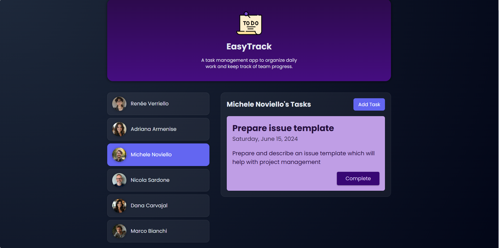

# EasyTrack



EasyTrack is a simple task management web application built with Angular.

## Features

- Select team members
- View assigned tasks
- Create new tasks
- Mark tasks as completed

## Technologies

- Angular
- TypeScript
- HTML
- CSS

## Run the project

Install dependencies:

```bash
npm install
```

Start the development server:

```bash
ng serve
```

Then open in your browser:

```
http://localhost:4200
```
